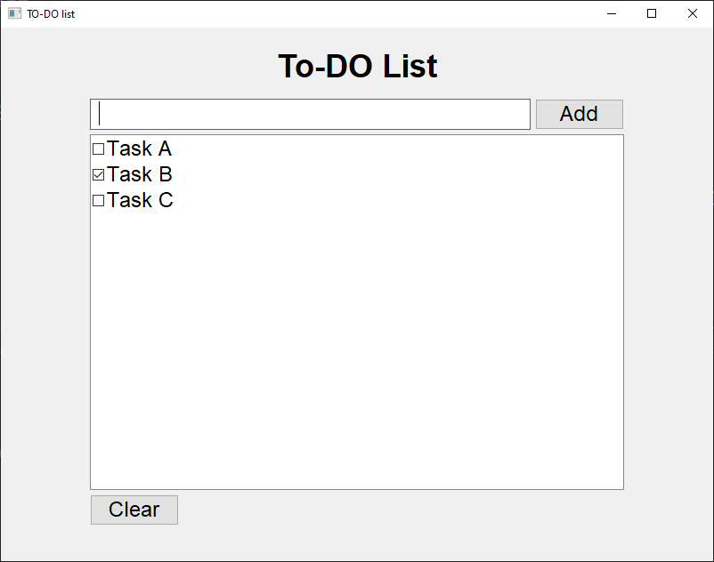

# TasksGui
[]

App for tracking tasks made with c++ and wxWidgets. 
Basic explanation of buttons:
- InputField - here you type task name and by pressing Enter, it will be adde in Check List
- Add button - alternative way to add task
- Check List - place where tasks appear, you can switch positions of tasks with arrows or 
              delete task with delete button and of course check the task as ready
- Clear button - asks if you are sure if you want to delete all tasks and if confirmed it deletes them.
- Exit button - when app closed, it saves the task in file in the same directory with name "tasks.txt"